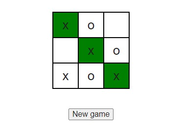

<h1 align="center">«Tick-Tack-Toe Game»</h1>

<h2>Descripion</h2>
 Implemented the game 'X or O'. Players are marking by turns the
 spaces in a 3x3 grid with X or O.  
**GAME FLOW**:
   - The game should randomly decide which player has the first turn at the beginning of the round and highlight his name. After every turn, the highlighted name should      change accordingly.
   - Player should be allowed to mark only an empty cell.
   - Once a player succeeded to mark the whole row, the game should display an appropriate message (e.g. ‘Player 1 won!’) and increment winner’s score. The winning row      should be highlighted or crossed out.
   - When all 9 squares are full and no player has 3 marks in a row, the game is over with a draw. ‘Draw!’ message should be displayed and both player’s scores are          increased by 1.
   - When user press ‘New game’ button, the grid should be cleared, but players' scores should remain.
   - When users press ‘Clear button’, both players' scores and grid should be cleared.

<h2>Technologies</h2>

+ HTML
+ SCSS
+ JavaScript
+ Webpack
+ Babel

<h3 align="center"><a href="https://drozdovdenys.github.io/calculator/">SEE LIVE</a></h3>
